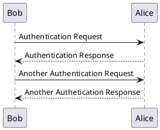
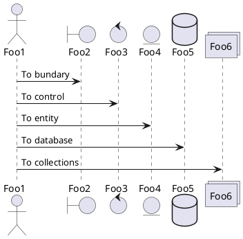

# 1. 时序图

## 1.1 简单示例

-  可以使用`->`绘制参与者之间传递的消息。    
*也可以使用`-->`绘制虚线箭头。此外还能使用`<-`和`<--`，提高可读性。*

## 1.2 声明参与者

- 关键字`participant`用于改变参与者的先后顺序。
- 也可以使用其他关键字来声明参与者：
  - actor
  - boundary
  - control
  - entity
  - database
  - collections

