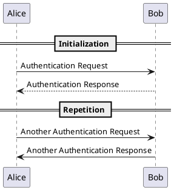

## 1.15 分隔符
- 可以通过`==`关键字来将图表分割多个步骤

```plantuml
@startuml
== Initialization ==
Alice -> Bob: Authentication Request
Bob --> Alice: Authentication Response

== Repetition ==
Alice -> Bob: Another Authentication Request
Bob -> Alice: Another Authentication Response

@enduml
```