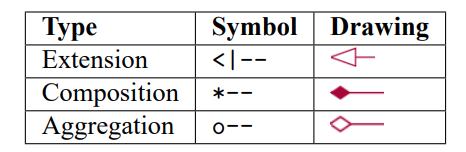

## 3.1 类之间的关系
- 类之间的关系通过下面的符号定义：

   
*注：组合是强关联；聚集是弱关联。*

- 使用`..`来代替`--`可以得到点线

```
@startuml
Class01 <|-- Class02
Class03 *-- Class04
Class05 o-- Class06
Class07 .. Class08
Class09 -- Class10
@enduml
```


```
@startuml
Class11 <|.. Class12
Class13 --> Class14
Class15 ..> Class16
Class17 ..|> Class18
Class19 <--* Class20
@enduml
```


```
@startuml
Class21 #-- Class22
Class23 x-- Class24
Class25 }-- Class26
Class27 +-- Class28
Class29 ^-- Class30
@enduml
```

